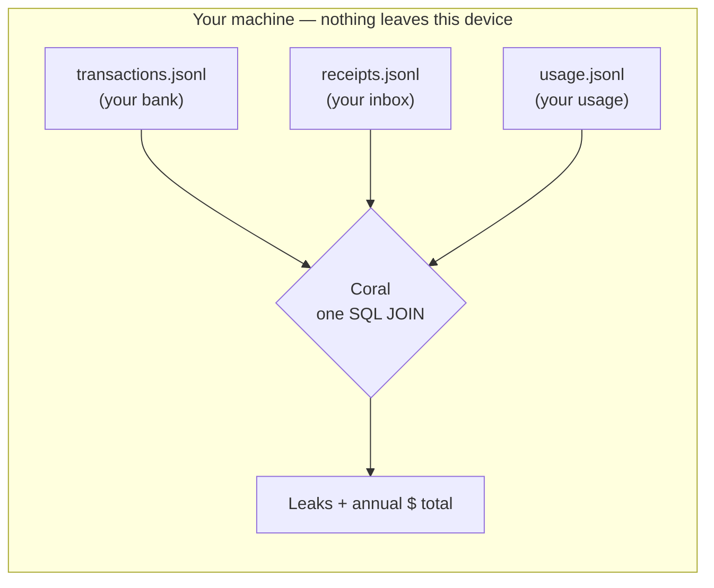
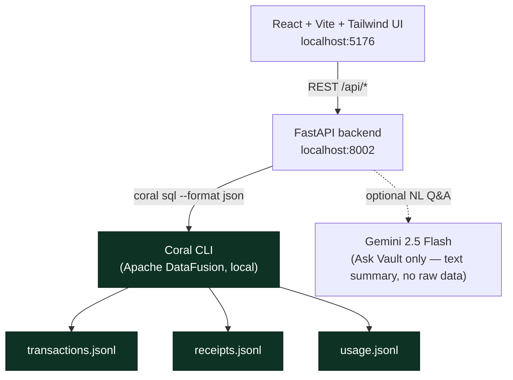
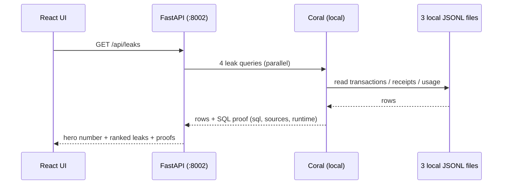
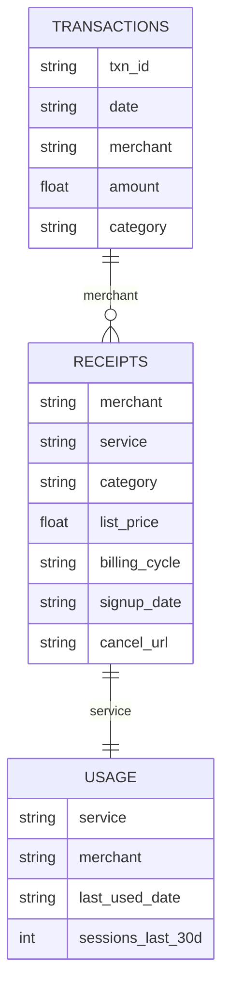

# Vault - the money agent that never sends your data to the cloud

> **Vault reads your bank statement, your inbox receipts, and your app usage — finds the money quietly leaking out of your life — and does it 100% on your machine, because Coral runs locally.**

Most personal-finance tools want you to upload your bank login to their cloud. Vault never does. Coral reads your files as SQL tables **locally**, joins them in one query, and the answer never leaves your laptop. That privacy guarantee is the whole point — and it's only possible because Coral is local-first.

---

## The problem

Your money leaks in the gaps between apps:

- Your **bank** knows you got charged $44 — but not that you haven't opened Peloton in 5 months.
- Your **inbox** knows you signed up for a free trial — but not that it's about to bill you $59.99.
- Your **usage** knows you stopped using Evernote — but not that you're still paying for it.

No single app connects *money spent* → *what you signed up for* → *whether you actually use it*. **Coral joins all three in one query** — and that join is the product.

---

## How it works — the three-source join

Vault reads three independent local files as SQL tables and joins them in a single Coral plan:

| Source | What it knows | Coral table |
|---|---|---|
| Bank export | money out, by merchant and date | `vault.transactions` |
| Inbox receipts | what you signed up for, when, list price | `vault.receipts` |
| App usage | when you last actually used each service | `vault.usage` |



**The killer query** — money × sign-up × usage in one statement:

```sql
SELECT r.service,
       r.list_price                AS monthly,
       ROUND(r.list_price * 12, 2) AS annual_waste,
       u.last_used_date
FROM vault.receipts r
JOIN vault.usage u        ON u.service  = r.service
JOIN vault.transactions t ON t.merchant = r.merchant AND t.category = 'subscription'
WHERE r.billing_cycle = 'monthly'
  AND CAST(u.last_used_date AS DATE) < CAST(CURRENT_DATE AS TIMESTAMP) - INTERVAL '60 days'
GROUP BY r.service, r.list_price, u.last_used_date
ORDER BY annual_waste DESC
```

→ *"You're paying $44/mo for Peloton and haven't opened it since December."*

No single tool can do this. Coral reads a **local file** and joins it to other local sources in one SQL plan, entirely on your machine. (Coral treats files as first-class sources alongside APIs, so the same query also runs against live Gmail or Google Calendar if you ever want it to.)

---

## Architecture



Everything that touches your financial data is **local**: Coral reads the three JSONL files and computes every leak and number on your machine. The only optional outbound call is **Ask Vault**, which sends a short text summary (never your raw transactions) to Gemini to phrase an answer.

### Request flow for the main view



---

## What Vault finds

| Leak type | What it detects | Example from the demo data |
|---|---|---|
| **Forgotten / zombie** | charged monthly, unused 60+ days | Peloton $528/yr, Evernote $180, Audible $179, Disney+ $168, Apple Music $132 |
| **Silent price hike** | charge crept above the signup price | Netflix $15.49 → $17.99 |
| **Duplicate category** | two services doing the same job | Spotify + Apple Music · Notion + Evernote |
| **Trial converting** | a $0 trial about to bill | Adobe → $59.99/mo in 2 days |
| **Annual renewal** | a yearly charge sneaking up | Amazon Prime $139 in 3 days |
| **Cloud creep** | a bill quietly growing | AWS $12 → $83 over 4 months |

The dashboard headline sums the reviewable leak into a single **Annual Leak** number (≈ **$2,485/yr** on the demo data, of which ≈ $1,187 is in clearly-forgotten subscriptions).

---

## Features

- **Annual Leak score** — one big number, computed live from the three-source join.
- **Leaks feed** — every leak ranked by yearly impact, each with a one-tap **safe cancellation draft** (a pre-written email + the real cancel link). Vault drafts; you decide.
- **Privacy & Network panel** — proves local-first: `0 cloud calls`, `data on this device`, `offline ✓`, plus a **"Verify offline"** button that runs a real Coral query live (turn off Wi-Fi and it still works).
- **One query, three sources** — a visual of the `transactions × receipts × usage` join.
- **Savings CTA** — *"Cancel N flagged → save $X/yr"* with the running total.
- **Spend Map** — a donut of where every dollar goes.
- **Ask Vault** — plain-English questions answered by live Coral SQL + Gemini, **with the SQL query attached** to every answer.
- **iPhone brief** — a plain-text endpoint for Apple Shortcuts: *"$2,485/yr leaking across 5 forgotten subscriptions…"*
- **Coral proof panel** — every number carries its SQL, sources, row count, and runtime.

---

## API reference

| Endpoint | Method | Returns |
|---|---|---|
| `/api/leaks` | GET | Hero number + ranked leaks + SQL proofs |
| `/api/privacy` | GET | Local-first proof + a live local-read verification |
| `/api/spend-map` | GET | Spend by category (donut data) |
| `/api/subscriptions` | GET | All subscriptions with usage |
| `/api/draft-cancel` | POST | Safe cancellation email draft (never sent) |
| `/api/ask` | POST | NL answer + the Coral SQL proofs behind it |
| `/api/iphone/brief` | GET | Plain-text brief for Apple Shortcuts |
| `/api/coral/health` | GET | Vault source readiness |

---

## Data model

Three local JSONL files in `data/`, generated by `scripts/seed_data.py`:



---

## Local-first & safety

- **Read-only.** Vault never cancels a subscription, emails anyone, or mutates anything upstream. It only drafts actions for you to take yourself.
- **Local-only.** All financial data and every computed number stay on your machine. Coral reads the JSONL files via the `jsonl` backend — there is no cloud database and no upload.
- **Honest exception:** the optional Ask Vault feature sends a short text summary (not your raw transactions) to Gemini to phrase a natural-language answer. The core analysis never leaves the device.

---

## Setup

**Prerequisites:** Coral CLI, Python 3.11+, Node 18+.

**1. Generate the demo data:**

```bash
cd vault
python scripts/seed_data.py
```

**2. Register the Vault source with Coral** (local file source — no keys, no cloud):

```bash
coral source add --file sources/vault/manifest.yaml
```

> The manifest's `location: file:///mnt/d/coral/vault/data/` is the WSL path to this folder. If you move the project, update that path.

**3. Backend** (port 8002):

```bash
cd backend
pip install -r requirements.txt
uvicorn main:app --port 8002
```

**4. Frontend** (port 5176):

```bash
cd frontend
npm install && npm run dev
# open http://localhost:5176
```

---

## Project structure

```text
vault/
├── data/                     # 3 local JSONL files (bank, receipts, usage)
├── scripts/seed_data.py      # regenerates the demo data
├── sources/vault/manifest.yaml   # Coral jsonl source (3 tables)
├── backend/
│   ├── main.py               # FastAPI endpoints
│   ├── queries.py            # leak-detection SQL
│   ├── leaks.py              # scoring + payload assembly
│   ├── drafts.py             # safe cancellation drafts
│   ├── coral_runner.py       # coral sql subprocess + proof objects
│   └── gemini_client.py      # Ask Vault synthesis
├── frontend/
│   └── src/components/        # HeroLeak, LeaksFeed, PrivacyPanel,
│                              # JoinDiagram, SavingsCta, SpendMap,
│                              # AskVault, LocalFirstBadge, CoralProof
├── queries.md                # all leak queries, with sample output
└── demo-script.md            # walkthrough script
```

---

## Tech stack

Python · FastAPI · Coral (Apache DataFusion) · React 18 · Vite · TypeScript · Tailwind · Recharts · Gemini 2.5 Flash (Ask Vault only).
